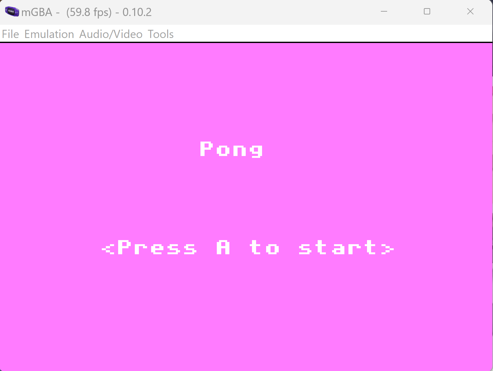
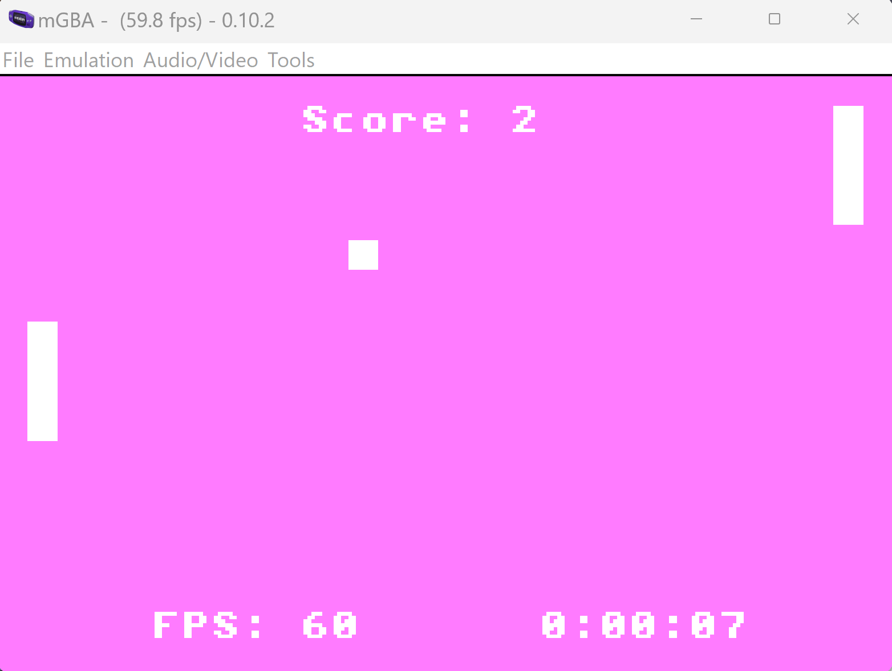

# pong
A slight spin on the game 'Pong' built for GBA.

## Game features
- Title screen
- Score counter
- FPS tracker
- Time tracker

## Dependencies
- devkitpro (latest)
  - https://github.com/devkitPro/installer/releases/tag/v3.0.3
  - The following directories must be discoverable in the execution environment so that the make file will work:
    - [devkitPro install location]\devkitARM\bin
    - [devkitPro install location]\tools\bin 
- libgba (0.5.2)
  - Comes installed with devkitpro
  - Latest release:
    - https://github.com/devkitPro/libgba/releases/tag/v0.5.2
- make (latest)
  - For Windows, the latest GnuWin32 make software should be sufficient: 
    - https://gnuwin32.sourceforge.net/packages/make.htm

## Building

Run the `make` command to build the project. The ROM will be built and copied to the 
**game/** directory. The **build/** directory contains all build artifacts created at each step.

The `make clean` & `make cleanall` commands remove build artifacts that have been generated.
